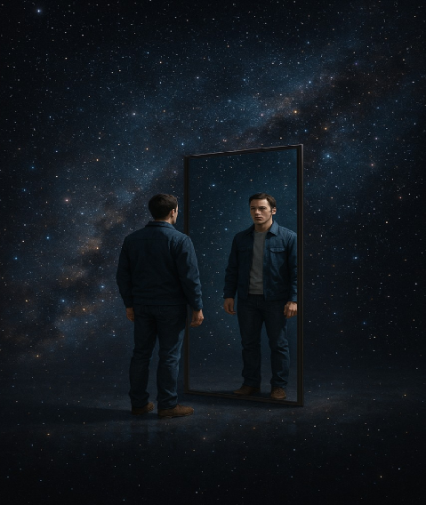

# Algunas implicaciones especulativas en los Universos Siameses  

*Versión en inglés:* [Some Speculative Implications in Siamese Universes (PDF)](./Some-Speculative-Implications.pdf)  

  

<em>Ilustración conceptual: el universo y su reflejo especular.</em>

# Algunas implicaciones especulativas en los Universos Siameses

---

## Especulaciones iniciales  

Imaginemos que nuestra realidad no es única, sino que existe otra —un universo siamés—: dos realidades que comparten un mismo origen, pero cuyas flechas del tiempo, causas y efectos están disociadas, como reflejos que nunca llegan a coincidir.  

La mera posibilidad abre un abanico de implicaciones: ¿qué significa la causalidad si existen universos donde las secuencias se desarrollan en sentido inverso? ¿Qué ocurre con la noción de identidad si nuestra materia pudiera resonar con la de un universo gemelo?  

La cosmología especulativa nos invita a reflexionar sobre la fragilidad del concepto de realidad. Si hay universos entrelazados dentro de la misma matriz, entonces lo que percibimos como solidez física podría no ser más que un cruce de perspectivas.  

En ese escenario, uno podría preguntarse: ¿es posible que la materia —su masa y consistencia— no pertenezca exclusivamente a nuestro universo, sino que surja de la coexistencia de dos universos siameses, donde la existencia de cada uno dependa únicamente del efecto dual? Quizá lo que percibimos como solidez no sea más que la proyección compartida de dos realidades entrelazadas.  

Desde esta perspectiva, el entrelazamiento cuántico podría entenderse no como un misterio aislado, sino como la manifestación extrema de esa unión: partículas conectadas no solo a través de nuestro espacio-tiempo, sino también mediante la simetría que ha vinculado ambos universos desde el inicio de sus tiempos.  

Así como existen partículas y antipartículas, el entrelazamiento actuaría como el comodín del juego cuántico: la carta que garantiza la coherencia dual. Cuando una partícula muestra un espín hacia arriba, su compañera aparece hacia abajo, intrínseca e inevitablemente, sin importar la distancia. ¿Podrían, en realidad, ser la misma partícula? Esa correlación no sería una coincidencia estadística, sino la huella exacta de una conexión entre ambos universos desde el origen, en un juego que trasciende la propia dimensión.  

Precisamente por eso, si algún día descubriéramos una forma de cruzar las fronteras dimensionales, encontraríamos que la flecha del tiempo sigue siendo siempre unidireccional. Y, sin embargo, si pudiéramos contemplar a un hipotético viajero universal, lo percibiríamos con la flecha del tiempo invertida. Tal vez —y ahí radica el límite— la propia imposibilidad de visualizar tal escenario no sea casual, sino parte esencial de la física misma.  

Aun así, uno puede imaginar la posibilidad de diseñar relaciones o experimentos que revelen esa conexión siamesa. El candidato más natural es el propio entrelazamiento cuántico, pero aquí la física impone un límite estricto: el entrelazamiento no puede usarse como canal directo de comunicación entre universos, ni para transmitir información más rápido que la luz. Su poder reside en otra parte: en las correlaciones perfectas que persisten sin importar la distancia, fósiles de un origen compartido.  

En este marco, se abren tres vías de exploración:  

1. **Experimentos de laboratorio:** pruebas de desigualdades de Bell con fotones o átomos entrelazados, teletransportación cuántica o condensados de Bose-Einstein. Hoy podemos alcanzar distancias orbitales —como en el satélite *Micius*— y sistemas macroscópicos, buscando desviaciones estadísticas del formalismo estándar.  
2. **Cosmología cuántica:** el fondo cósmico de microondas y la distribución de la materia podrían contener huellas de correlaciones primordiales, reliquias de un entrelazamiento forjado en el Big Bang o en un condensado primigenio.  
3. **Escenarios extremos:** agujeros negros y rebotes cuánticos (LQC) podrían ser lugares donde el entrelazamiento sobrevive “eternamente”, sostenido por la holografía o la condensación colectiva.  

Hoy, lo que podemos hacer es llevar el entrelazamiento a sus límites experimentales y buscar anomalías reproducibles: desviaciones en las correlaciones de Bell, patrones inusuales de decoherencia en condensados o asimetrías persistentes entre materia y antimateria. Ninguno de estos resultados probaría por sí solo la existencia de universos siameses, pero constituirían indicios indirectos, ventanas desde las cuales asomarse a lo impensable.  

Imaginemos también un escenario aún más extremo: que un día pudiéramos generar un agujero negro microscópico y lanzar en él una de las partículas de un par entrelazado. La física convencional sostiene que el entrelazamiento se rompería, diluido en la aparente pérdida de información. Sin embargo, si el espín de la partícula compañera permaneciera inmutable, coherente e independiente de la distancia, tendríamos una indicación indirecta de que la correlación sobrevive al cruce del horizonte.  

Dentro del marco de los universos siameses, esa supervivencia del entrelazamiento no significaría que la partícula se conserva en nuestro lado, sino que prolonga su coherencia en el universo gemelo. La que permanece aquí seguiría llevando la huella de esa unión, como si el agujero negro no fuera una tumba cuántica, sino una frontera translúcida que redistribuye las correlaciones en el tejido dual.  

Es probable que esta idea, con otras formas, ya haya aparecido en discusiones sobre la paradoja de la información o los “muros de fuego” de los agujeros negros. Pero aquí adquiere otro matiz: se convierte en un criterio de firma siamesa, donde el espín actúa como testigo de una coherencia que no muere, sino que se comparte entre dos universos. No una prueba definitiva, sino un atisbo de que lo imposible quizá solo sea lo invisible.  

---

## Metáforas y motores del progreso  

El poeta Paul Éluard escribió: *“Hay otros mundos, pero están en éste.”* Tal vez esas palabras no sean solo una joya literaria, sino una clave para comprender nuestra propia naturaleza existencial. Quizá los universos siameses no estén “afuera” o “al lado”, sino inscritos en la propia trama de la realidad, en la dualidad de la materia, en correlaciones que desafían el espacio y el tiempo.  

Esa frase nos recuerda que la curiosidad, la intuición y la pasión son los motores esenciales del conocimiento humano. No necesitamos ser exploradores espaciales para buscar respuestas; a veces basta con sentarse a contemplar las estrellas, dejando que la mente se abra a lo invisible.  

Quizá la verdad no esté “allá afuera”, como decían Mulder y Scully, sino “aquí adentro”, en nuestra capacidad de meditar y reflexionar. Y en ese ejercicio, la especulación no es un lujo, sino una brújula: lo que nos permite explorar territorios que la ciencia aún no sabe describir.  

El gran Yogi Berra lo expresó a su manera: *“Cuando llegues a una bifurcación en el camino, tómala.”* Esa ironía resume el coraje de abrazar la paradoja, de aceptar que a veces hay que recorrer caminos divergentes sin miedo al error. El conocimiento no avanza solo mediante certezas, sino también a través de decisiones arriesgadas que a menudo parecen contradictorias.  

Platón ya lo advirtió en su alegoría de la cueva: lo que vemos son sombras, reflejos parciales de una realidad mayor. Interpretarlas requiere tanto rigor como imaginación. Y quizá, al final, esas sombras nunca se materialicen del todo en algo tangible o medible —o sin duda aparecerán otras nuevas—. Pero, como dijo Machado, *“lo importante es el camino.”*  

Y es en este camino presente donde empezamos a coexistir con otras formas de inteligencia, donde parece esencial que la ciencia se adapte a los nuevos tiempos y no al revés. Pensar fuera del marco se volverá cada vez más relevante, al igual que aprender a transmitir, a comunicar y a abrir el conocimiento académico a nuevos actores inesperados.  

---

**Autor:** Cosmic Thinker  
**Versión original:** *Some Speculative Implications in Siamese Universes* (English PDF)  
